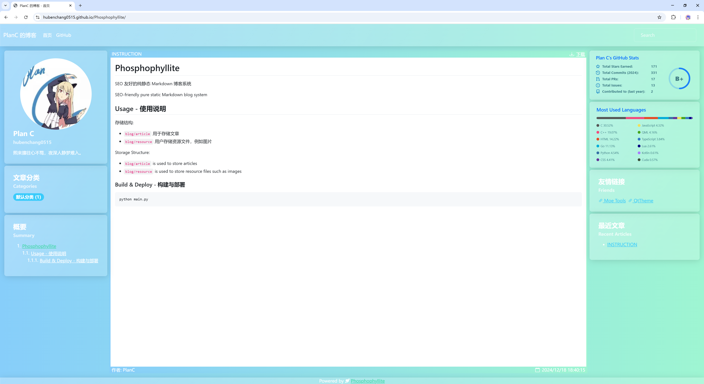

# Phosphophyllite

SEO 友好的纯静态 Markdown 博客系统

SEO-friendly pure static Markdown blog system



## Usage - 使用说明

存储结构:  

* `blog/article` 用于存储文章
* `blog/resource` 用户存储资源文件，例如图片

Storage Structure:  

* `blog/article` is used to store articles
* `blog/resource` is used to store resource files such as images

### Build & Deploy - 构建与部署

```bash
python main.py
```
