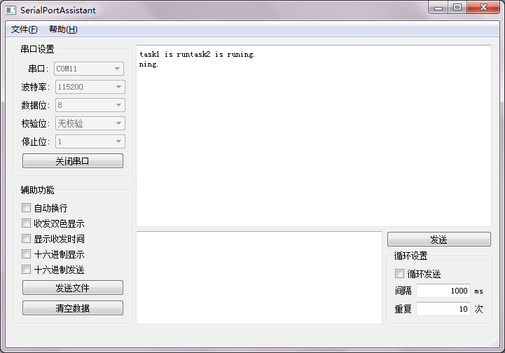
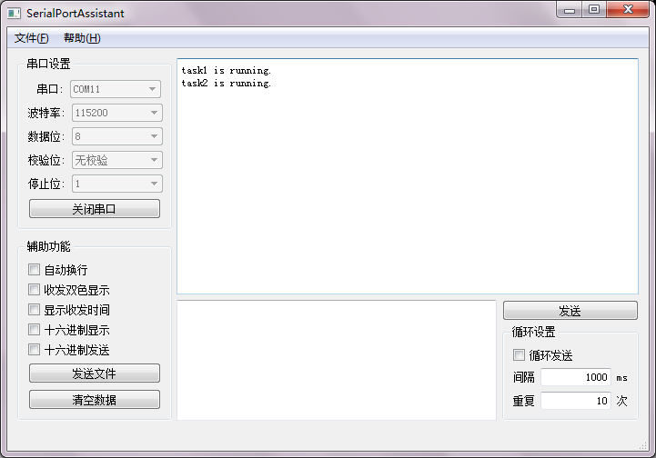

# FreeRTOS 临界区  
在并行编程中，并行存取共享的资源时，常常会导致意外和错误的结果。例如下面代码task1和task2都通过串口打印消息，但由于任务调度，消息被截断了。  
```C
#include <stm32f4xx.h>
#include <FreeRTOS.h>
#include <task.h>
#include <uart.h>
 
void task1(void* args);
void task2(void* args);
 
int main()
{
    //配置USART1
    USART1_Config();
    //创建任务
    TaskHandle_t h1,h2;
    xTaskCreate(task1,"task1",configMINIMAL_STACK_SIZE,NULL,1,&h1);
    xTaskCreate(task2,"task2",configMINIMAL_STACK_SIZE,NULL,1,&h2);
    //开启任务调度
    vTaskStartScheduler();
    while(1);
}
 
 
void task1(void* args)
{
    USART_printf(USART1,"task1 is running.\n");
    vTaskDelete(NULL);
}
 
void task2(void* args)
{
    USART_printf(USART1,"task2 is running.\n");
    vTaskDelete(NULL);
}
```

  

类似的，当修改公共变量时任务调度可能导致变量的值错误、操作时序严格的设备时任务调度可能导致设备不能正常工作。

因此，访问共享资源的部分代码会被保护起来，在执行这段代码时不进行任务调度，这样的代码段称为`临界区(Critical Section)`。

FreeRTOS通过两个包含在task.h里的宏`taskENTER_CRITICAL()`、`taskEXIT_CRITICAL()`来进入和离开临界区在。`taskENTER_CRITICAL()`之后、`taskEXIT_CRITICAL()`之前不会切换到其他任务。

修改`USART_printf`函数，在打印消息前后加入`taskENTER_CRITICAL()`和`taskEXIT_CRITICAL()`，这样在`USART_printf`运行期间就不会切换任务，打印的消息也就不会被截断。

```C
#define USART_PRINTF_BUFFER_SIZE 256
 
int USART_printf(USART_TypeDef* port,const char* fmt,...)
{
    char str[USART_PRINTF_BUFFER_SIZE];
    int length,index;
    va_list argList;
    va_start(argList,fmt);
    length = vsnprintf(str,USART_PRINTF_BUFFER_SIZE-1,fmt,argList);
    va_end(argList);
    taskENTER_CRITICAL();//进入临界区
    for(index = 0 ; index < length ; index++)
    {
        USART_WriteByte(port,str[index]);
    }
    taskEXIT_CRITICAL();//离开临界区
    return length;
}
```

  

临界区嵌套是安全的，因为内核有维护一个嵌套深度计数。临界区只会在嵌套深度为`0`时才会真正退出——即在为每个之前调用的`taskENTER_CRITICAL()`都配套调用了`taskEXIT_CRITICAL()`之后。  

临界区是互斥功能的一种非常原始的实现方式，通常只是关闭所有中断从而使任务调度暂停。这样可能会导致任务不能正常执行，中断不能及时响应等问题。所以临界区应当只具有很短的时间。上例中打印串口消息是一个相当耗费时间的过程，并不适合使用临界区。  

另外也可以将调度器挂起来保护临界区，`vTaskSuspendAll`挂起调度器、`xTaskResumeAll`恢复调度器，在`vTaskSuspendAll`和`xTaskResumeAll`之间不会进行任务调度，但可以响应中断。  

```C
#include <task.h>
void vTaskSuspendAll(void);
BaseType_t xTaskResumeAll(void);
```