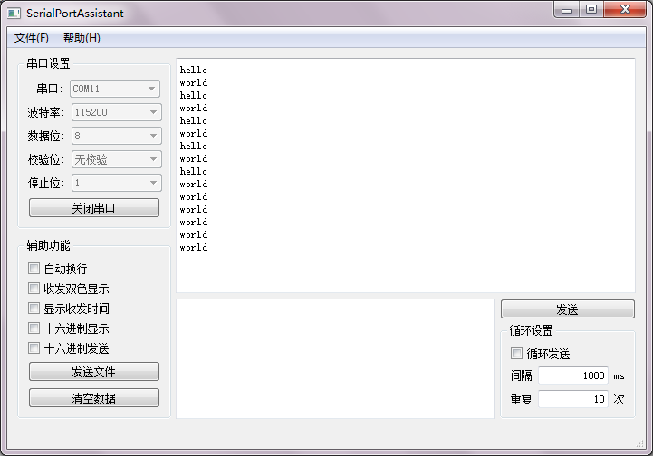

# FreeRTOS 任务的创建与删除

FreeRTOS的任务函数原型为:  
```C
void task(void* args);
```

使用FreeRTOS的`xTaskCreate`函数来创建任务：  
```C
#include <task.h>
BaseType_t xTaskCreate(TaskFunction_t pxTaskCode,
             const char * const pcName,
            const uint16_t usStackDepth,
            void * const pvParameters,
            UBaseType_t uxPriority,
            TaskHandle_t * const pxCreatedTask ) PRIVILEGED_FUNCTION;
//返回值：成功返回pdPASS；失败返回errCOULD_NOT_ALLOCATE_REQUIRED_MEMORY
```
* `pxTaskCode`是任务函数，没有返回值(void)，参数为void*
* `pcName`是任务的名字，用于调试，其长度不能超过configMAX_TASK_NAME_LEN
* `usStackDepth`是任务的堆栈深度，其四倍即是堆栈的大小(字节数)
* `pvParameters`是传给任务函数的参数
* `uxPriority`是任务优先级,数值越大，优先级越高，0为最低优先级
* `pxCreatedTask`是返回的任务句柄

使用`vTaskStartScheduler`函数来开启任务调度：
```C
#include <task.h>
void vTaskStartScheduler(void);
```

FreeRTOS的任务函数不能返回，对于不再需要的任务，应当使用`vTaskDelete`函数来进行删除，其参数是`xTaskCreate`最后一个参数返回的任务句柄，将参数设为`NULL`表示删除当前任务：  
```C
#include <task.h>
void vTaskDelete(TaskHandle_t xTaskToDelete);
```

下面是一个例子，创建两个任务，通过串口打印消息：  
```C
#include <stm32f4xx.h>
#include <FreeRTOS.h>
#include <task.h>
#include <uart.h>
 
void task1(void* args);
void task2(void* args);
 
int main()
{
    //配置USART1
    USART1_Config();
    //创建任务
    TaskHandle_t h1,h2;
    xTaskCreate(task1,"task1",configMINIMAL_STACK_SIZE,"hello\n",1,&h1);
    xTaskCreate(task2,"task2",configMINIMAL_STACK_SIZE,"world\n",1,&h2);
    //开启任务调度
    vTaskStartScheduler();
    while(1);
}
 
 
void task1(void* args)
{
    int i = 0;
    while(1)
    {
        //循环5次后删除自己
        if(i >= 5)
        {
            vTaskDelete(NULL);
        }
        //打印参数
        USART_printf(USART1,args);
        //延时1000ms
        vTaskDelay(1000/portTICK_RATE_MS);
        i++;
    }
}
 
void task2(void* args)
{
    int i = 0;
    while(1)
    {
        //循环10次后删除自己
        if(i >= 10)
        {
            vTaskDelete(NULL);
        }
        //打印参数
        USART_printf(USART1,args);
        //延时1000ms
        vTaskDelay(1000/portTICK_RATE_MS);
        i++;
    }
}
```
  
  

附.USART代码代码 :  
```C
/**
  * @file       uart.c
  * @author     PlanC
  * @blog       www.kurukurumi.com
  * @brief      configure USART1 to print message
  */
 
#include <stdarg.h>
#include <stdio.h>
#include <stm32f4xx.h>
#include <uart.h>
 
/**
  * @brief  Initialize the USART1
  * @note   set USART1_RX GPIOA10 as push-pull output
  *           set USART1_TX GPIOA9 as pull-up input
  *           set USART1 as 115200-8-N-1
  */
void USART1_Config(void)
{
    GPIO_InitTypeDef gpio;
    USART_InitTypeDef usart;
     
    // enable the perpheral clock
    RCC_AHB1PeriphClockCmd(RCC_AHB1Periph_GPIOA,ENABLE);
    RCC_APB2PeriphClockCmd(RCC_APB2Periph_USART1, ENABLE);
     
    gpio.GPIO_Mode = GPIO_Mode_AF;
    gpio.GPIO_PuPd = GPIO_PuPd_UP;
    gpio.GPIO_OType = GPIO_OType_PP;
    gpio.GPIO_Speed = GPIO_High_Speed;
     
    //set UART1_RX GPIOA10 as push-pull output
    gpio.GPIO_Pin = GPIO_Pin_10;
    GPIO_Init(GPIOA,&gpio);
    GPIO_PinAFConfig(GPIOA,GPIO_PinSource10,GPIO_AF_USART1);
     
    //set UART1_TX GPIOA9 as pull-up input
    gpio.GPIO_Pin = GPIO_Pin_9;
    GPIO_Init(GPIOA,&gpio);
    GPIO_PinAFConfig(GPIOA,GPIO_PinSource9,GPIO_AF_USART1);
     
    //set USART1 as 115200-8-N-1
    usart.USART_Mode = USART_Mode_Rx | USART_Mode_Tx;
    usart.USART_BaudRate = 115200;
    usart.USART_WordLength = USART_WordLength_8b;
    usart.USART_Parity = USART_Parity_No;
    usart.USART_StopBits = USART_StopBits_1;
    USART_Init(USART1,&usart);
    USART_Cmd(USART1,ENABLE);
}
 
 
/**
  * @brief  Send a byte data from USART
  * @param  port: the USART which will be used
  * @param  data: the data which will be sent
  */
 
void USART_WriteByte(USART_TypeDef* port,uint8_t data)
{
    USART_SendData(port,data);
    while(USART_GetFlagStatus(port,USART_FLAG_TXE) == RESET);
}
 
 
/**
  * @brief  print a format string from USART
  * @param  port: the USART which will be used
  * @param  fmt: the format string
  *
  */
 
#define USART_PRINTF_BUFFER_SIZE 256
 
int USART_printf(USART_TypeDef* port,const char* fmt,...)
{
    char str[USART_PRINTF_BUFFER_SIZE];
    int length,index;
    va_list argList;
    va_start(argList,fmt);
    length = vsnprintf(str,USART_PRINTF_BUFFER_SIZE-1,fmt,argList);
    va_end(argList);
    for(index = 0 ; index < length ; index++)
    {
        USART_WriteByte(port,str[index]);
    }
    return length;
}
```
