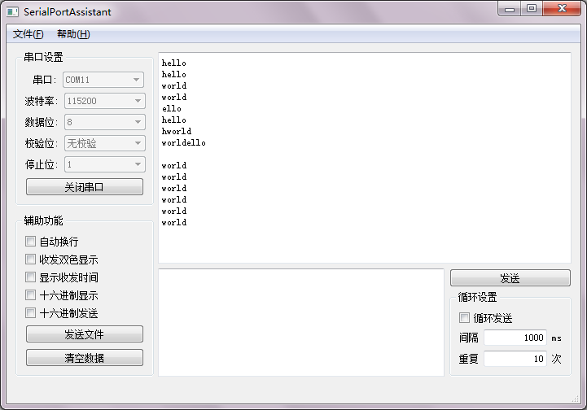
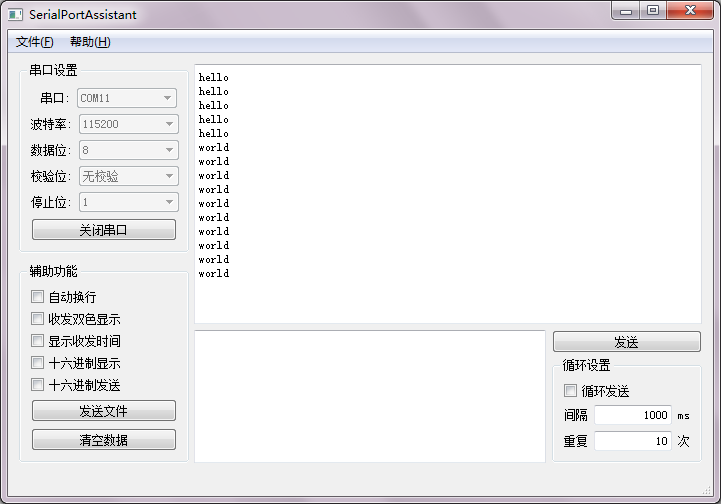
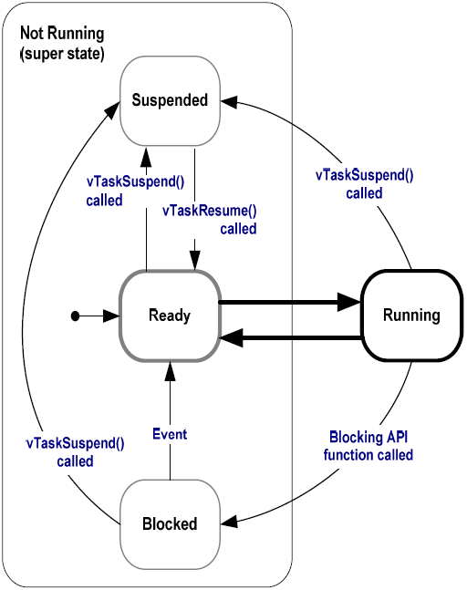

# FreeRTOS 任务的状态

在`xTaskCreate`函数创建任务时，即为任务赋予了优先级。可以使用`vTaskPrioritySet`函数来修改任务的优先级，它的第一个参数是任务句柄、第二个参数是优先级，这个函数必须在调度器启动之后才能调用。相应的，`uxTaskPriority`函数返回一个任务的优先级。  
```C
#include <task.h>
void vTaskPrioritySet(TaskHandle_t xTask,UBaseType_t uxNewPriority);
 
UBaseType_t uxTaskPriorityGet(TaskHandle_t xTask);
//返回任务的优先级
```

对于优先级相同的任务，FreeRTOS采用时间片轮询调度，每个任务轮流执行一段微小的时间。下面这段代码创建两个优先级相同的任务打印串口消息：  
```C
#include <stm32f4xx.h>
#include <FreeRTOS.h>
#include <task.h>
#include <uart.h>
 
void task1(void* args);
void task2(void* args);
 
int main()
{
    //配置USART1
    USART1_Config();
    //创建任务
    TaskHandle_t h1,h2;
    xTaskCreate(task1,"task1",configMINIMAL_STACK_SIZE,"hello\n",1,&h1);
    xTaskCreate(task2,"task2",configMINIMAL_STACK_SIZE,"world\n",1,&h2);
     
    //开启任务调度
    vTaskStartScheduler();
    while(1);
}
 
 
void task1(void* args)
{
    int i = 0;
    while(1)
    {
        //循环5次后删除自己
        if(i >= 5)
        {
            vTaskDelete(NULL);
        }
        //打印参数
        USART_printf(USART1,args);
        i++;
    }
}
 
void task2(void* args)
{
    int i = 0;
    while(1)
    {
        //循环10次后删除自己
        if(i >= 10)
        {
            vTaskDelete(NULL);
        }
        //打印参数
        USART_printf(USART1,args);
        i++;
    }
}
```
  
  

对于优先级不同的任务，FreeRTOS采用抢占式调度，高优先级的任务优先执行。将上面代码中的task1优先级设为2，task1会优先执行：  
```C
#include <stm32f4xx.h>
#include <FreeRTOS.h>
#include <task.h>
#include <uart.h>
 
void task1(void* args);
void task2(void* args);
 
int main()
{
    //配置USART1
    USART1_Config();
    //创建任务
    TaskHandle_t h1,h2;
    xTaskCreate(task1,"task1",configMINIMAL_STACK_SIZE,"hello\n",2,&h1);
    xTaskCreate(task2,"task2",configMINIMAL_STACK_SIZE,"world\n",1,&h2);
    //开启任务调度
    vTaskStartScheduler();
    while(1);
}
 
 
void task1(void* args)
{
    int i = 0;
    while(1)
    {
        //循环5次后删除自己
        if(i >= 5)
        {
            vTaskDelete(NULL);
        }
        //打印参数
        USART_printf(USART1,args);
        i++;
    }
}
 
void task2(void* args)
{
    int i = 0;
    while(1)
    {
        //循环10次后删除自己
        if(i >= 10)
        {
            vTaskDelete(NULL);
        }
        //打印参数
        USART_printf(USART1,args);
        i++;
    }
}
```
  
  

FreeRTOS中任务存在4种状态：`运行`、`就绪`、`阻塞`和`挂起`。调度器总是让运行和就绪状态的任务中，优先级最高的任务进入运行状态。  
  
|状态               |说明                           |
|:-:                |:-                              |
|运行状态(Running)  |   正在运行的任务处于运行状态  |
|就绪状态(Ready)    |   可以运行但没有运行的任务处于就绪状态    |
|阻塞状态(Blocked)  |   等待某一事件而不能运行的任务处于阻塞状态    |
|挂起状态(Suspended)|   调用vTaskSuspend挂起的任务处于挂起状态  |  

  

运行状态的任务可以通过调用阻塞函数进入阻塞状态，阻塞解除的事件可以让阻塞状态的任务进入就绪状态，`vTaskSuspend`函数让任务进入挂起状态，`vTaskResume`函数让挂起的任务进入就绪状态。  

`vTaskDelay`是一个阻塞函数，它让任务进入阻塞状态等待一个定时事件，它的参数是定时事件的延时时间(周期数)。当定时时间到达，就会产生定时事件，让任务进入就绪状态。  
```C
#include <task.h>
void vTaskDelay(const TickType_t xTicksToDelay);
```  
宏`portTICK_RATE_MS`表示每毫秒的周期数，用期望延时的毫秒数除以她可以得到相应的周期数，例如`vTaskDelay(1000/portTICK_RATE_MS)`延时1000毫秒。   

仍然让task1的优先级高于task2,在task1中调用`vTaskDelay`阻塞，在task1阻塞期间，task2是优先级最高的任务，因此运行task2：  
```C
#include <stm32f4xx.h>
#include <FreeRTOS.h>
#include <task.h>
#include <uart.h>
 
void task1(void* args);
void task2(void* args);
 
int main()
{
    //配置USART1
    USART1_Config();
    //创建任务
    TaskHandle_t h1,h2;
    xTaskCreate(task1,"task1",configMINIMAL_STACK_SIZE,"hello\n",2,&h1);
    xTaskCreate(task2,"task2",configMINIMAL_STACK_SIZE,"world\n",1,&h2);
    //开启任务调度
    vTaskStartScheduler();
    while(1);
}
 
 
void task1(void* args)
{
    int i = 0;
    //阻塞1000ms
    vTaskDelay(1000/portTICK_RATE_MS);
    while(1)
    {
        //循环5次后删除自己
        if(i >= 5)
        {
            vTaskDelete(NULL);
        }
        //打印参数
        USART_printf(USART1,args);
        i++;
    }
}
 
void task2(void* args)
{
    int i = 0;
    while(1)
    {
        //循环10次后删除自己
        if(i >= 10)
        {
            vTaskDelete(NULL);
        }
        //打印参数
        USART_printf(USART1,args);
        i++;
    }
}
```

  

挂起状态的任务对于调度器而言是**不可见**的。`vTaskSuspend`让任务进入挂起状态，`vTaskResume`让挂起的任务进入就绪状态，它们的参数都是要操作任务的句柄。  
```C
#include <task.h>
void vTaskSuspend(TaskHandle_t xTaskToSuspend);
void vTaskResume(TaskHandle_t xTaskToResume);
```