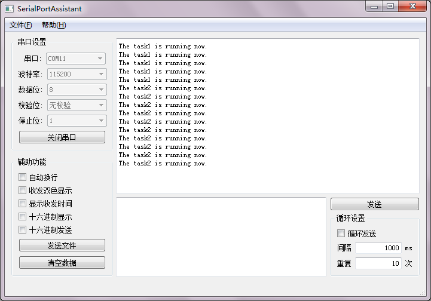

# FreeRTOS 信号量和互斥量  
`信号量(Semaphore)`也是一种任务间通信的常用方式，通常用于任务的同步。  
```C
#include <semphr.h>
 
BaseType_t xSemaphoreGive(SemaphoreHandle_t xSemaphore);
//产生一个信号，成功返回pdPASS
//信号量已满则失败，返回errQUEUE_FULL

BaseType_t xSemaphoreTake(SemaphoreHandle_t xSemaphore,TickType_t xBlockTime);
//获取一个信号，信号量为空则阻塞
//第二个参数是阻塞超时时间，成功返回pdTRUE，超时返回pdFALSE
```

值信号量是只有两个值(例如0或1、满或空)的信号量，FreeRTOS的二值信号量相当于只有一个元素的队列，用满和空表示信号量的值。  
```C
#include <semphr.h>
 
SemaphoreHandle_t xSemaphoreCreateBinary(void);
//创建一个二值信号量，成功返回信号量句柄，失败返回NULL
```
* 二值信号量为空时调用`xSemaphoreGive`，信号量变满；为满时失败。
* 二值信号量为满时调用`xSemaphoreTake`，信号量变空；为空时阻塞。

计数信号量顾名思义是计数用的信号量。
```C
#include <semphr.h>
 
SemaphoreHandle_t xSemaphoreCreateCounting(void);
//创建一个计数信号量，成功返回信号量句柄，失败返回NULL
 
UBaseType_t uxSemaphoreGetCount(const QueueHandle_t xSemaphore);
//返回计数信号量的计数值
```

* `xSemaphoreGive`使计数信号量加一。  
* `xSemaphoreTake`使计数信号量减一。  

信号量通常用于任务同步，例如多个任务共享资源时，使用二值信号量进行访问控制，二值信号量为满则表示资源可用，二值信号量为空则表示资源正在被使用。也可以使用计数信号量计数有多少个任务在使用共享资源。  

下面这个例子使用二值信号量标志串口是否被使用：  
```C
#include <stm32f4xx.h>
#include <FreeRTOS.h>
#include <task.h>
#include <queue.h>
#include <semphr.h>
#include <uart.h>
 
void task1(void* args);
void task2(void* args);
 
SemaphoreHandle_t binary;
 
int main()
{
    //配置USART1
    USART1_Config();
    //创建任务
    TaskHandle_t h1,h2;
    //创建二值信号量，用这个信号量标识串口是否可用
    binary = xSemaphoreCreateBinary();
    //使二值信号量变为满，表示资源可用
    xSemaphoreGive(binary);
    xTaskCreate(task1,"task1",configMINIMAL_STACK_SIZE,NULL,1,&h1);
    xTaskCreate(task2,"task2",configMINIMAL_STACK_SIZE,NULL,1,&h2);
    //开启任务调度
    vTaskStartScheduler();
    while(1);
}
 
 
void task1(void* args)
{
    int i = 0;
    while(1)
    {
        //循环五次后删除自己
        if(i >= 5)
        {
            vTaskDelete(NULL);
        }
        //使二值信号量变为空，表示资源被占用
        xSemaphoreTake(binary,100/portTICK_RATE_MS);
        USART_printf(USART1,"The task1 is running now.\n");
        //使二值信号量变为满，表示资源可用
        xSemaphoreGive(binary);
        i++;
    }
}
 
void task2(void* args)
{
    int i = 0;
    while(1)
    {
        //循环十次后删除自己
        if(i >= 10)
        {
            vTaskDelete(NULL);
        }
        //使二值信号量变为空，表示资源被占用
        xSemaphoreTake(binary,100/portTICK_RATE_MS);
        USART_printf(USART1,"The task2 is running now.\n");
        //使二值信号量变为满，表示资源可用
        xSemaphoreGive(binary);
        i++;
    }
}
```

  

不过这种方式可能导致优先级反转：  
```
(1)假设优先级task1>task2>task3  
(2)task1和task2阻塞或挂起  
(3)task3运行并通过二值信号量占用了某个公共资源  
(4)task1就绪并试图通过二值信号量使用被task3占用的资源，但由于资源被占用，task1阻塞  
(5)task2就绪，由于它优先级高于task3，因此task2优先执行  
(6)task2执行完之后task3继续执行  
(7)task3释放资源，task1解除阻塞并执行  
```
如此以来优先级相当于变成了task2>task1，原本优先级最高的task1不能及时运行，这在实时性要求高的场合是不被允许的。  


`互斥量(Mutex)`是处理共享资源同步的常用方式。在FreeRTOS的实现中，互斥量是一种特殊的二值信号量，其操作方式和二值信号量一样，但互斥量具有优先级继承的特性。  
```
(1)假设优先级task1>task2>task3  
(2)task1和task2阻塞或挂起  
(3)task3运行并通过互斥量占用了某个公共资源  
(4)task1就绪并试图通过互斥量使用被task3占用的资源，但由于资源被占用，task1阻塞  
(5)task3的优先级被提升到和task1一样  
```
如此一来就不会发生task2在task1之前运行的情况，提高了实时性。  

`xSemaphoreCreateMutex`用于创建互斥量。
```C
#include <semphr.h>
 
SemaphoreHandle_t xSemaphoreCreateMutex(void);
//创建一个互斥量，成功返回信号量句柄，失败返回NULL
```
>>假如任务中调用一个函数来使用公共资源，在调用这个函数前使用`xSemaphoreTake`占用该资源的互斥量，在这个函数返回后使用`xSemaphoreGive`来释放该资源的互斥量。但这个函数中可能也使用了`xSemaphoreTake`和`xSemaphoreGive`来占用和释放资源。这种情况下就会导致错误。

递归互斥量可以让同一个任务多次占用资源，在释放同等次数互斥量后释放资源。  
```C
#include <semphr.h>
 
SemaphoreHandle_t xSemaphoreCreateRecursiveMutex(void);
//创建一个递归互斥量，成功返回信号量句柄，失败返回NULL
```