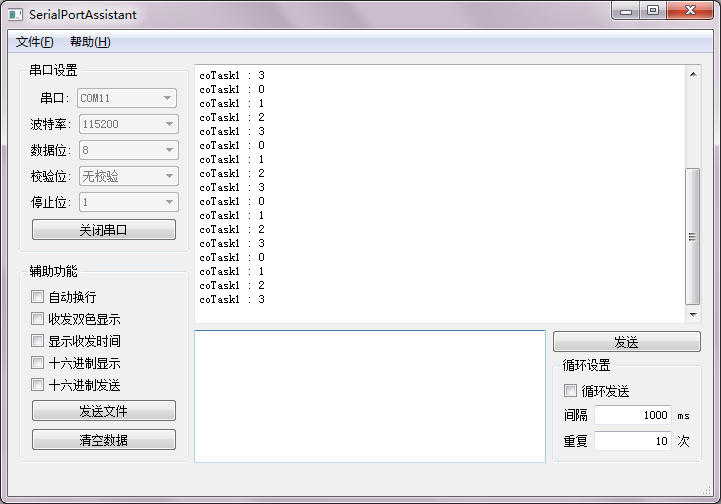

# FreeRTOS 协同程序  
协同程序是一种特殊的多任务编程方式，多个协同程序之间共用调用栈，且正在运行的协同程序不会被其他协程抢占(可以被任务和中断抢占)，正在运行的协同程序只能自己主动让出CPU的使用权。要使用协同程序，需要将`FreeRTOSConfig.h`中的`configUSE_CO_ROUTINES`设为`1`。  

FreeRTOS的协同程序采用`switch-case`实现，函数定义方式如下：  
```C
void CoRoutineTask(CoRoutineHandle_t handle,UBaseType_t uxIndex)
{
    //协同程序中变量如果要保证值在下一次运行时仍有效，则必须为static
    static const TickType_t delay = 1000 / portTICK_PERIOD_MS;
 
    //协同程序必须以crSTART(handle)开始
    crSTART(handle);
     
    //协同程序主体
    while(1)
    {
        /* 协同程序工作内容 */
         
        //主动阻塞1000ms，让出CPU使用权
        crDELAY(handle,delay);
    }
     
    //协同程序必须以crEND()结束
    crEND()    
}
```

使用`vCoRoutineSchedule`来调度协同程序，调用这个函数时，他会运行可运行的优先级最高的协同程序，当这个协同程序让出CPU时，`vCoRoutineSchedule`返回。需要不断的调用这个函数来进行协程的调度。  
```C
#include <croutine.h>
void vCoRoutineSchedule(void);
```

使用`xCoRoutineCreate`来创建一个协程，它的第一个参数是协程函数，第二个参数是协程优先级，可以用同一个协程函数创建多个协程，第三个参数用来区分同一个函数创建的协程。  
```C
#include <croutine.h>
BaseType_t xCoRoutineCreate(crCOROUTINE_CODE pxCoRoutineCode, 
                            UBaseType_t uxPriority, 
                            UBaseType_t uxIndex );
```

下面这个示例使用同一个函数创建了4个协程，协程函数打印uxIndex并阻塞1000ms:  
```C
#include <stm32f4xx.h>
#include <FreeRTOS.h>
#include <task.h>
#include <croutine.h>
#include <uart.h>
 
void coTask(CoRoutineHandle_t h,UBaseType_t uxIndex);
void task(void* args);
 
int main()
{
    //配置USART1
    USART1_Config();
    //创建协程
    xCoRoutineCreate(coTask,0,0);
    xCoRoutineCreate(coTask,0,1);
    xCoRoutineCreate(coTask,0,2);
    xCoRoutineCreate(coTask,0,3);
    //创建任务，用于调度协程
    xTaskCreate(task,"task1",configMINIMAL_STACK_SIZE,NULL,1,NULL);
    //启动任务调度器
    vTaskStartScheduler();
}
 
void task(void* args)
{
    while(1)
    {
        //运行优先级最高的协程,该协程让出时，函数返回
        vCoRoutineSchedule();
    }
}
 
 
void coTask(CoRoutineHandle_t handle,UBaseType_t uxIndex)
{
    //如果协程函数希望在阻塞后仍能保存变量的值，那么变量必须是static的
    static const TickType_t delay = 1000 / portTICK_PERIOD_MS;
     
    //协程函数必须以crSTART开始
    crSTART(handle);
     
    while(1)
    {
        //通过串口打印uxIndex
        USART_printf(USART1,"coTask1 : %d\n",uxIndex);
        //在协程中延时1000ms
        crDELAY(handle,delay);
    }
     
    //协程函数必须以crEND结束
    crEND();
     
}
```

  