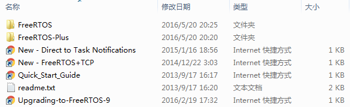
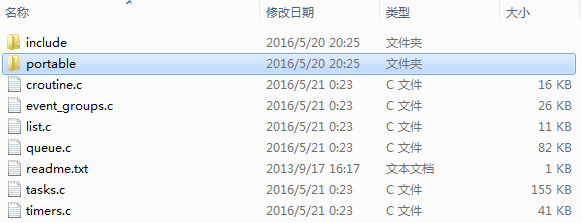
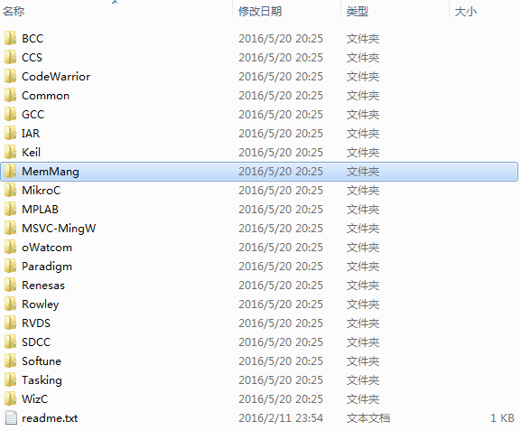
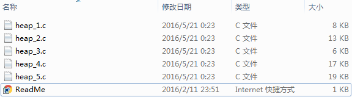
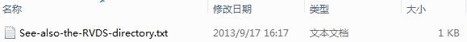
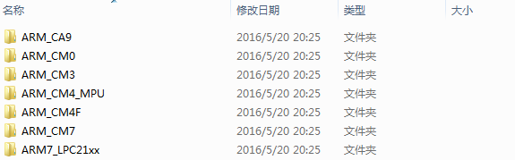
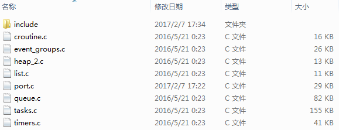
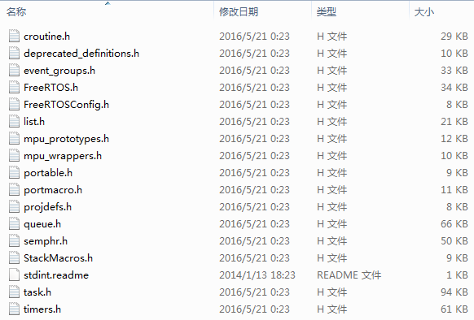

# FreeRTOS 搭建开发环境

本文使用Keil MDK和STM32为例  

首先需要下载FreeRTOS的源码：[http://www.freertos.org/](http://www.freertos.org/)。当前最新版本为9.0.0，其源码目录如下图 :  

  

在`FreeRTOS/Demo`目录下已经有许多工程可以直接使用，例如`FreeRTOS\Demo\CORTEX_STM32F103_Keil`就是STM32F103在Keil下的工程。不过这个工程是针对小容量STM32F103的，对于其他型号的STM32芯片，需要自己组织工程。  

**首先创建一个文件夹用于存放工程文件，命名为“`Project`”。**  
`FreeRTOS/Source`目录下是FreeRTOS的源码，将其中除了`portable`文件夹以外所有的文件复制到Project文件夹中，这些是平台无关的代码。  

  

`FreeRTOS/Source/portable`目录下是平台有关的可移植代码。  

  

其中`FreeRTOS/Source/protable/MemMang`目录下是内存管理的相关代码。  
* `heep_1.c`只能分配内存而不能释放内存。  
* `heep_2.c`可以分配和释放内存但不能合并空闲内存块。  
* `heep_3.c`简单的封装了线程安全版的标准C语言malloc和free函数。  
* `heep_4.c`可以合并相邻的空闲内存块。  
* `heep_5.c`可以合并相邻的空闲内存块，且可以管理地址不连续的物理内存。  

这里选用heep_2.c，将它复制到Project文件夹中。  

  

接下来，由于我们的目标平台是`Keil`，因此代开`FreeRTOS/Source/protable/Keil`文件夹看到如下文件。  

  

因此我们打开`FreeRTOS/Source/protable/RVDS`文件夹，根据芯片型号选择。我的目标芯片`STM32F429IGT6`是`Cortex-M4F`内核，因此将`ARM_CM4F`中的`port.c`复制到`Project`中，`portmacro.h`复制到`Project/include`中。  

  

然后，我们还需要一个`FreeRTOSConfig.h`，在`FreeRTOS/Demo/CORTEX_M4F_STM32F407ZG-SK`中复制它到`Project/include`中。

**最后得到Project以及include下的文件：**  
  
  

接下来将这些文件复制到一个Keil的STM32标准外设库工程中，将.c文件加入工程，将include文件夹加入头文件搜索路径。

接下来需要修改部分代码：  

`FreeRTOS`使用了一些中断功能，因此`port.c`中定义了部分中断函数，STM32标准外设库中的`stm32f4xx_it.c`中也定义了这些中断函数，因此需要删除`stm32f4xx_it.c`中的这些函数。它们是`SVC_Handler`、`PendSV_Handler`和`SysTick_Handler`。  

`port.c`中使用了变量`SystemCoreClock`,这个变量定义在标准外设库的`system_stm32f4xx.c`中，需要在`port.c`中声明。  

`FreeRTOS`中使用了一些`hook`函数，这些函数需要我们自己编写(可以写成空的函数)，也可以将`FreeRTOSConfig.h`中的`configUSE_IDLE_HOOK`、`configUSE_TICK_HOOK`、`configUSE_MALLOC_FAILED_HOOK`和`configCHECK_FOR_STACK_OVERFLOW`设为`0`从而不使用这些hook函数。  

如此一来工程就配置完成了。  