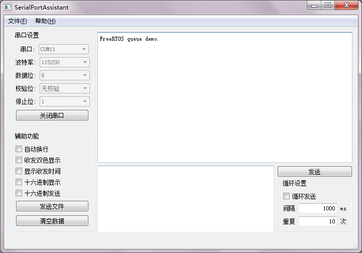

# FreeRTOS 队列  
队列(Queue)是一种数据结构，它是一种特殊的线性表，只允许在队列的首端进行删除，尾端进行插入，具有先入先出的特性。是任务间通信的一种常用方式。  

`xQueueCreate`函数创建一个队列，它的第一个参数是队列的长度(元素的个数)，第二个参数是每个元素的大小(byte)。  
```C
#include <queue.h>
QueueHandle_t xQueueCreate(const UBaseType_t uxQueueLength,const UBaseType_t uxItemSize);
//成功返回队列句柄，失败返回NULL
```  

FreeRTOS中既可在队尾插入，也能在队首插入，但是只能从队首取出数据。  
```C
#include <queue.h>
 
BaseType_t xQueueSendToBack( QueueHandle_t xQueue, 
                            const void * const pvItemToQueue, 
                            TickType_t xTicksToWait);
//向队尾插入一个元素
 
BaseType_t xQueueSendToFront( QueueHandle_t xQueue, 
                            const void * const pvItemToQueue, 
                           TickType_t xTicksToWait);
//向队首插入一个元素
```

它们的第一个参数是队列句柄，第二个参数是指向要插入的数据的指针(该数据的大小必须和创建队列时设置的元素大小一样)，第三个参数是阻塞超时时间。

如果队列未满。则插入数据并返回`pdPASS`；如果队列已满则阻塞，若在阻塞超时时间之前队列变成未满则插入数据并返回`pdPASS`,若到达阻塞超时时间则返回`errQUEUE_FULL`。

`xQueueReceive`读取队首元素并将其从队列中删除，`xQueuePeek`读取队首元素但不删除。  
```C
#include <queue.h>
 
BaseType_t xQueueReceive( QueueHandle_t xQueue, 
                            void * const pvBuffer, 
                            TickType_t xTicksToWait);
//成功返回pdTRUE，失败返回pdFALSE
 
BaseType_t xQueuePeek( QueueHandle_t xQueue, 
                            void * const pvBuffer, 
                            TickType_t xTicksToWait);
//成功返回pdTRUE，失败返回pdFALSE
```

他们的第一个参数是队列句柄，第二个参数返回读取到的元素，第三个参数是阻塞超时时间。队列为空时阻塞等待数据，超时则返回`pdFASLE`。

`uxQueueMessagesWaiting`可以查询队列中当前有多少个元素。
```C
#include<queue.h>
UBaseType_t uxQueueMessagesWaiting(const QueueHandle_t xQueue);
//返回队列中元素的个数
```

下面是一个使用队列进行通信的例子：  
```C
#include <stm32f4xx.h>
#include <FreeRTOS.h>
#include <task.h>
#include <queue.h>
#include <uart.h>
 
void task1(void* args);
void task2(void* args);
 
QueueHandle_t queue;
 
int main()
{
    //配置USART1
    USART1_Config();
    //创建任务
    TaskHandle_t h1,h2;
    //创建队列
    queue = xQueueCreate(10,128);
    xTaskCreate(task1,"task1",configMINIMAL_STACK_SIZE,NULL,1,&h1);
    xTaskCreate(task2,"task2",configMINIMAL_STACK_SIZE,NULL,2,&h2);
    //开启任务调度
    vTaskStartScheduler();
    while(1);
}
 
 
void task1(void* args)
{
    char str[128] = "FreeRTOS queue demo.\n";
    //向队列发送数据
    xQueueSendToBack(queue,str,100/portTICK_RATE_MS);
    vTaskDelete(NULL);
}
 
void task2(void* args)
{
    char str[128];
    //从队列中读取数据
    xQueueReceive(queue,str,100/portTICK_RATE_MS);
    USART_printf(USART1,str);
    vTaskDelete(NULL);
}
```

  