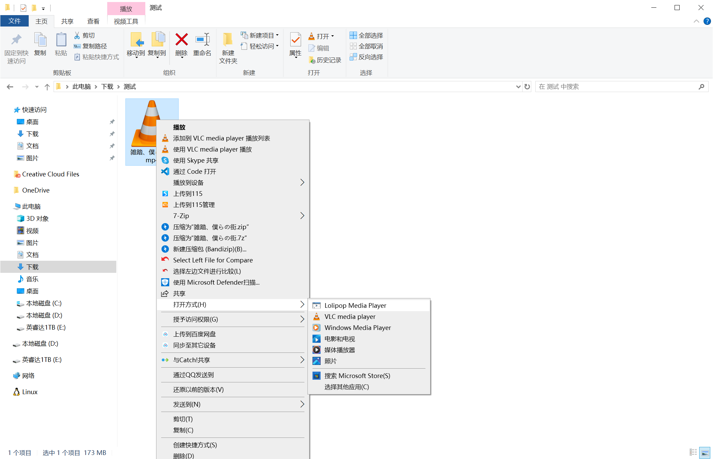

# Windows 注册表中添加自己的程序



以 [Lolipop Media Player](https://github.com/hubenchang0515/Lolipop) 为例。

> 本文全部使用 `HKEY_CURRENT_USER`，表示当前用户的配置。
> 可以替换为 `HKEY_LOCAL_MACHINE`，表示所有用户的配置。

## 注册应用程序

参考 [应用程序注册 - Win32 apps](https://learn.microsoft.com/zh-cn/windows/win32/shell/app-registration)

添加 `HKEY_CURRENT_USER\SOFTWARE\Microsoft\Windows\CurrentVersion\App Paths\<ApplicationName>.exe` 子项来注册应用程序。

它包含两个值：  

* `(默认)` - 表示应用程序的可执行文件路径
* `Path` - 表示程序运行时添加到 `PATH 环境变量` 中的值。

示例:  

```
Windows Registry Editor Version 5.00

[HKEY_CURRENT_USER\SOFTWARE\Microsoft\Windows\CurrentVersion\App Paths\lolipop.exe]
@="C:\\Lolipop\\lolipop.exe"
"Path"="C:\\Lolipop\\"
```

配置后可以在 `开始菜单` 或 `命令` 中快速启动程序，即使程序不在 `PATH 环境变量` 中。

## 注册为类

添加 `HKEY_CURRENT_USER\SOFTWARE\Classes\<ApplicationName>.exe` 子项，它包含以下子项：  

* `shell` - 提高从 *打开方式* 中启动程序时的命令
* `FriendlyAppName` - 应用程序显示的名称
* `SupportedTypes` - 关联的文件类型，右键这些类型的文件时可以在 *打开方式* 中显示此程序
* `Application` - 应用的描述信息

示例：  

```
[HKEY_CURRENT_USER\SOFTWARE\Classes\lolipop.exe]
[HKEY_CURRENT_USER\SOFTWARE\Classes\lolipop.exe\shell]
[HKEY_CURRENT_USER\SOFTWARE\Classes\lolipop.exe\shell\open]
@="Play"

[HKEY_CURRENT_USER\SOFTWARE\Classes\lolipop.exe\shell\open\command]
@="\"C:\\Lolipop\\lolipop.exe\" \"%1\""

[HKEY_CURRENT_USER\SOFTWARE\Classes\lolipop.exe\FriendlyAppName]
@="Lolipop Media Player"

[HKEY_CURRENT_USER\SOFTWARE\Classes\lolipop.exe\SupportedTypes]
".mp3"=""
".mp4"=""

[HKEY_LOCAL_MACHINE\SOFTWARE\Classes\lolipop.exe\Application]
"ApplicationCompany"="Plan C"
"ApplicationDescription"="Multimedia Player"
```

## 关联文件类型

在 `HKEY_CURRENT_USER\SOFTWARE\Classes\<Extension>\OpenWithProgids` 子项中添加 `<ApplicationName>.exe`，使应用程序显示到该类型文件的 *打开方式* 中。

示例：  

```
[HKEY_CURRENT_USER\SOFTWARE\Classes\.mp3\OpenWithProgids]
"lolipop.exe"=hex(0):

[HKEY_CURRENT_USER\SOFTWARE\Classes\.mp4\OpenWithProgids]
"lolipop.exe"=hex(0):
```
