# 在 eu.org 注册免费域名

[eu.org](eu.org) 是一个可以免费注册三级域名的公益组织。

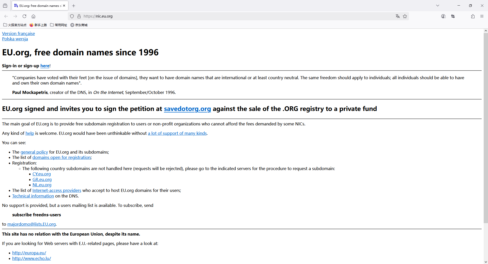

## 注册账号

### 进入注册页面

点击这里进入账号注册页面：

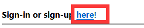

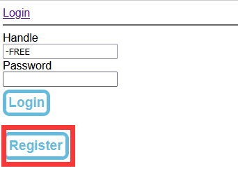

### 填写注册信息

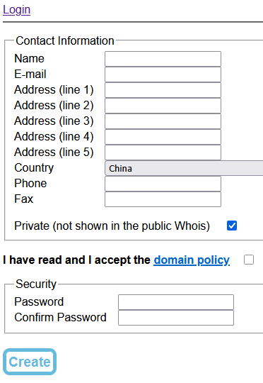

* Name 是你的真实姓名，而不是用户名，用户名是注册后自动生成的。
  * 你可以使用假名，他对合法名字的判断方式视乎是 **有空格**，例如 `PlanC` 不能注册，但 `Plan C` 可以。
* E-mail 是你的电子邮箱，将被用于验证和反馈。
* Address 可以随便填
* Country 选择你所在的国家
* Phone 可以不填
* Fax 可以随不填
* Private 建议勾选，选中后 whois 中会隐藏你的信息

### 接收验证邮件

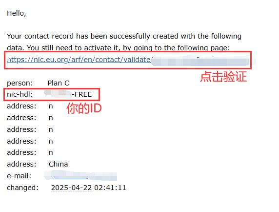
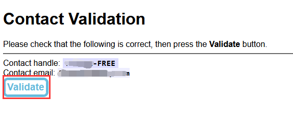

收到邮件后点击验证链接，然后点击 `Validate` 进行验证。

## 注册域名

登录后点击 `New Domain` 开始注册:

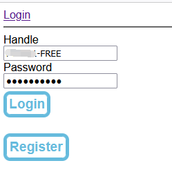

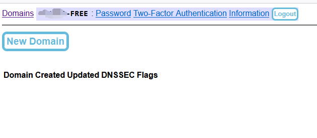

### 填写域名

填写你想要的完整域名，其它信息都是根据账号信息自动填充的，不需要填写：

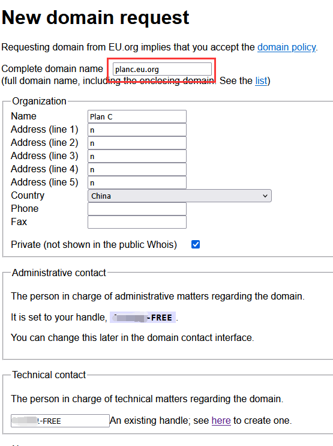

### 填写 DNS

[eu.org](eu.org) 不提供 DNS 服务，你需要使用其它 DNS 服务进行域名解析，这里使用 CloudFlare 的免费 DNS 服务：

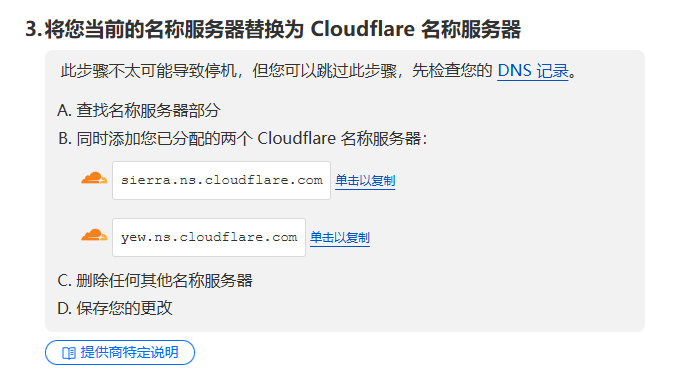

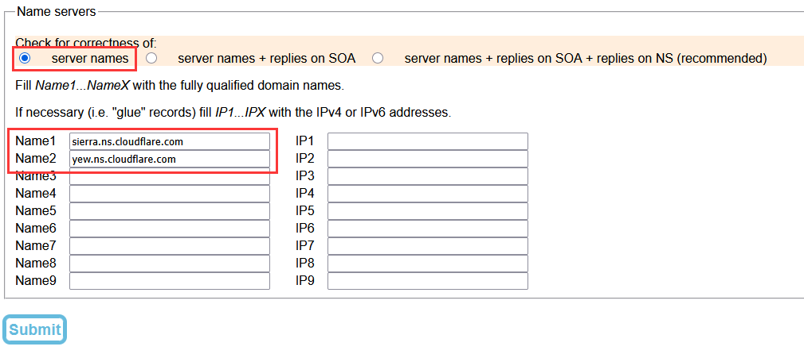

填写完成后点击 `Submit` 完成注册，成功时可以看到以下信息：

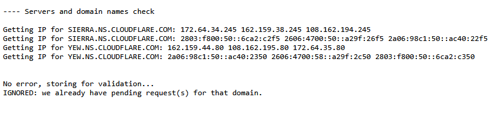

## 等待审核

[eu.org](eu.org) 审核很慢，并且时间不稳定，几天到几个月都有可能，审核成功后会收到邮件。